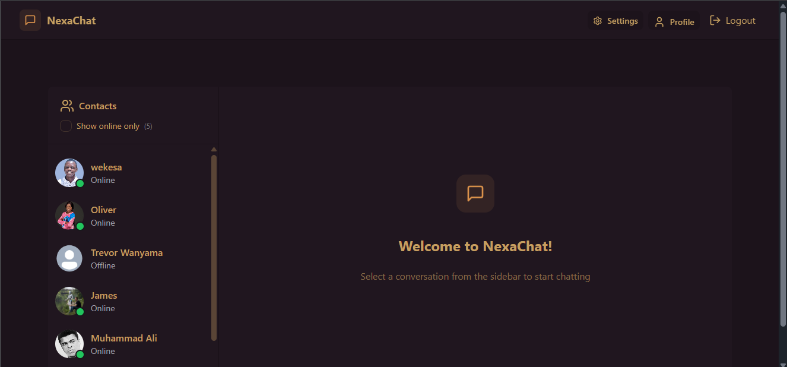
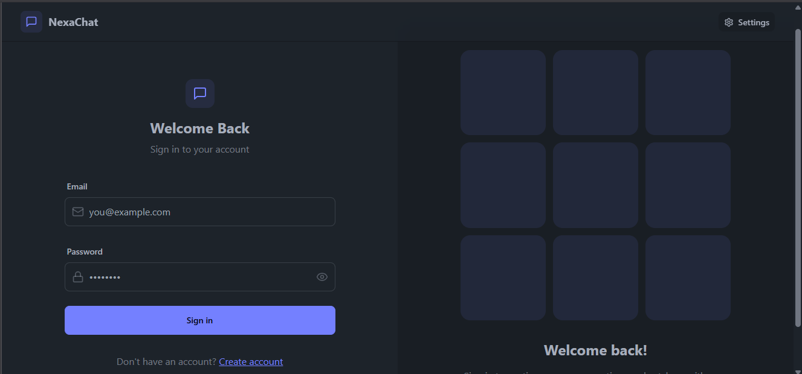
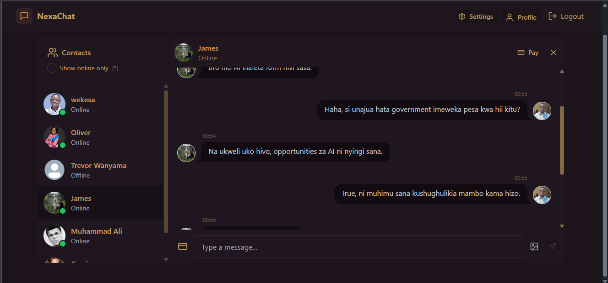
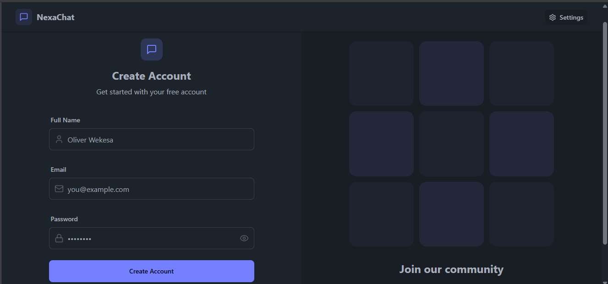
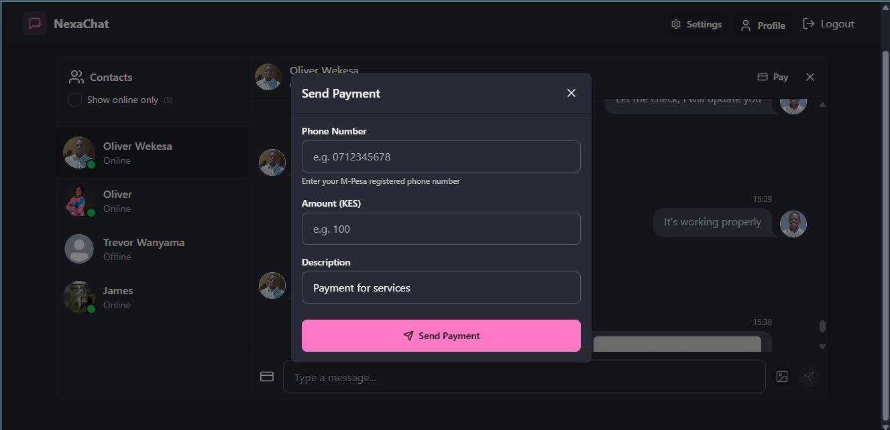
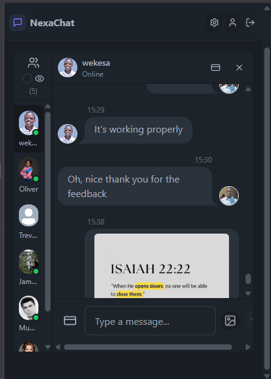
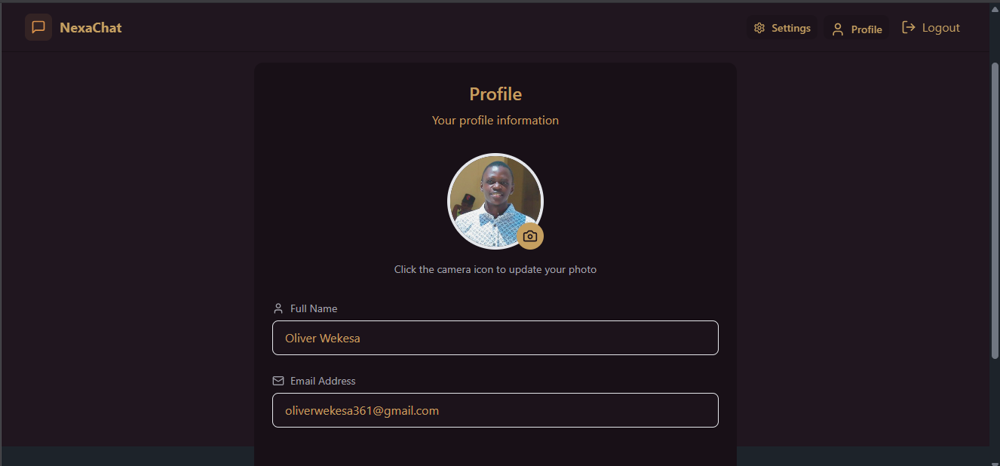
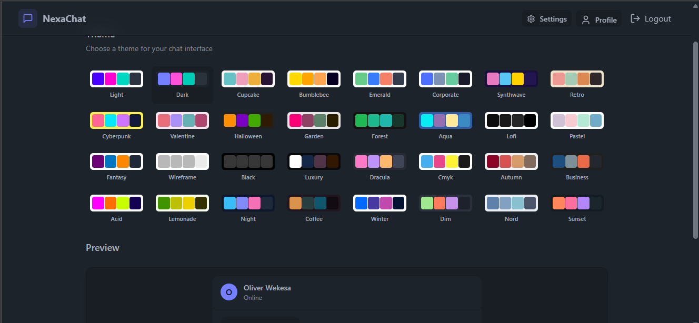

# NexaChat

**NexaChat** is a real-time messaging platform with secure user authentication, media sharing capabilities, and integrated mobile payments via M-Pesa. Built with modern web technologies, it enables seamless communication and transaction experiences in one application.

---

## 🚀 Features
### Backend
- 🔐 **User Authentication** – Secure login and registration using JWT and hashed passwords.
- 💬 **Real-time Messaging** – Instant message delivery using Socket.io.
- 📁 **Media Support** – Upload and deliver media files via Cloudinary integration.
- 💳 **M-Pesa Integration** – Initiate and track mobile payments directly within the app.
- 🧾 **Payment Request System** – Easily create and manage payment requests.
- 🌐 **CORS-enabled API** – Works with frontend clients like React or Vue.

### Frontend
- 🔐 **User Authentication** – Sign up and log in with protected routes.
- 🙋 **Profile & Settings Pages** – Manage user profiles and preferences.
- 📶 **Online Users Tracker** – See who’s online in real time.
- 🎨 **Theming Support** – Light/dark mode and customizable themes.
- 🚀 **React + Vite + Tailwind CSS** – Super-fast builds and responsive UI.
- 🔔 **Notifications** – Integrated toast messages using `react-hot-toast`.

---

## 🧩 Problem It Solves

In regions where mobile money is central to daily transactions (like in Kenya), chat and payment apps are usually separate. NexaChat combines both, allowing users to:

- Chat in real-time
- Share media
- Send or request payments, all from one place

This helps streamline workflows for freelancers, small businesses, and teams needing integrated communication and payment functionality.

---

## 🛠️ Tech Stack

- **Backend**: Node.js, Express, MongoDB, Socket.io
- **Authentication**: JWT, bcryptjs, cookies
- **Media**: Cloudinary
- **Payments**: M-Pesa Daraja API
- **Environment Management**: dotenv

---

## 📦 Installation

### Prerequisites

- Node.js (v16+)
- MongoDB
- A Cloudinary account (for media handling)
- M-Pesa Daraja credentials

### Backend Setup

```bash
git clone https://github.com/wekesaoliver/NexaChat.git
cd Nexachat/Backend

# Install dependencies
npm install

# Create .env file
cp .env.example .env
# Fill in MongoDB URI, JWT secret, Cloudinary & M-Pesa credentials

# Start the server
npm run dev
```

### Frontend Setup

```bash
# Clone the repository
cd client

# Install dependencies
npm install

# Start the development server
npm run dev
```

# 📁 Folder Structure
```
backend/
├── src/
│   ├── routes/              # API route definitions
│   ├── lib/                 # DB and socket setup
│   ├── middleware/          # Authentication middleware
│   ├── models/              # Chat models setup
│   ├── utils/               # Mpesa utilities
│   ├── controllers/         # Request handlers
│   └── index.js             # App entry point
├── .env                     # Environment variables
├── package.json             # Node.js project metadata
└── ...
```

```
client/
├── components/         # Reusable UI components (Navbar, etc.)
├── constants/          # Static constants and config values
├── lib/                # Utility functions and helpers
├── pages/              # Page components (Home, Login, Signup, etc.)
├── store/              # Zustand stores for auth, theme, etc.
├── App.jsx             # Main app component with routing
├── main.jsx            # Entry point for the React app
├── index.html          # HTML template
├── tailwind.config.js  # Tailwind CSS configuration
├── vite.config.js      # Vite configuration
└── package.json        # Project metadata and dependencies
```

---

## 📸 Screenshots

Here’s a preview of the NexaChat application:

| Home Page | Login Page |
|-----------|------------|
|  |  |

| Chat Interface | Signup page |
|----------------|---------------|
|  |  |

| M-Pesa Payment | Mobile Screen |
|----------------|------------------|
|  |  |

| User Profile | Settings Page |
|--------------|----------------|
|  |  |


# 📮 API Endpoints
Route	Description
/api/auth	Auth (register/login)
/api/messages	Messaging routes
/api/mpesa	M-Pesa payment initiation
/api/payment-requests	Payment request management

# ✨ Future Enhancements
🔔 Push notifications
👥 Group chat functionality
🤖 AI-powered chatbot integration
📈 Analytics dashboard

# 🧑‍💻 Contributing

1. Pull requests are welcome! For major changes, please open an issue first to discuss what you would like to change.
2. Fork the repository
3. Create your feature branch (git checkout -b feature/AmazingFeature)
4. Commit your changes (git commit -m 'Add some AmazingFeature')
5. Push to the branch (git push origin feature/AmazingFeature)
6. Open a pull request

© 2025 NexaChat. All rights reserved.
